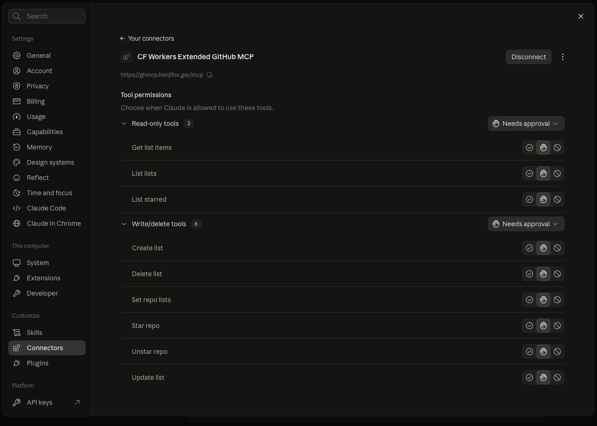

# GitHub Extended MCP

A remote [MCP](https://modelcontextprotocol.io) server on Cloudflare Workers that extends what Claude can do with your GitHub account beyond the standard GitHub tools. It signs you in with GitHub OAuth, so it works as a custom connector in claude.ai (or any MCP client that supports remote servers with OAuth).

The first feature set is **starred repos and Star Lists**. Star Lists only exist in GitHub's GraphQL API (there is no REST endpoint), and no existing connector exposes them, so this server wraps those GraphQL calls as MCP tools. More account-level features can be added alongside them over time.



## Tools

Stars and lists (current):

| Tool | Kind | What it does |
|---|---|---|
| `list_starred` | read | Your starred repos, newest first, cursor paginated (id, name, description, language, topics, stars, archived, url). |
| `list_lists` | read | Your Star Lists with ids and item counts. |
| `get_list_items` | read | Repos inside one list, paginated. |
| `create_list` | write | Create a list (name, description, private or public). |
| `update_list` | write | Rename or edit a list. |
| `set_repo_lists` | write | Add repos to lists and/or remove them, many repos per call. |
| `star_repo` | write | Star a repo. |
| `unstar_repo` | destructive | Unstar a repo (its list memberships go with it). |
| `delete_list` | destructive | Delete a list. Needs `confirm: true`. Repos stay starred. |

GitHub's `updateUserListsForItem` **replaces** a repo's whole set of lists. `set_repo_lists` reads the repo's current lists first and merges your adds and removes, so existing memberships are never wiped by accident.

Tool annotations (`readOnlyHint`, `destructiveHint`) are set, so claude.ai groups them as read-only and write/delete and lets you set approval per group.

## Deploy

Before you start you need a **GitHub OAuth App** (not a GitHub App; GitHub Apps use fine-grained permissions instead of the scopes this server requests).

### 1. Create the GitHub OAuth App

GitHub > Settings > Developer settings > OAuth Apps > New OAuth App.

- Homepage URL: anything, for example the URL of this repo.
- Authorization callback URL: put a placeholder for now (`https://example.com/callback`). You will fix it after the first deploy, once you know your worker's URL.
- Leave "Enable Device Flow" off, and do not enable expiring user tokens (the server does not refresh GitHub tokens; it expires its own sessions instead, see Security).

Generate a client secret and keep the client ID and secret for the next step.

### 2. Deploy to Cloudflare

[](https://deploy.workers.cloudflare.com/?url=https://github.com/BenjiThatFoxGuy/github-api-mcp-extended-workers)

The button asks for four values:

| Name | Value |
|---|---|
| `GITHUB_CLIENT_ID` | Client ID of your OAuth App |
| `GITHUB_CLIENT_SECRET` | Client secret of your OAuth App |
| `COOKIE_ENCRYPTION_KEY` | Any random secret. Generate one with `openssl rand -hex 32` |
| `ALLOWED_GITHUB_LOGINS` | Your GitHub username (comma separated for several). **Only these accounts can use the server.** |

Cloudflare creates the KV namespace and Durable Object for you.

### 3. Fix the callback URL

Your server is now at `https://<worker-name>.<your-subdomain>.workers.dev`. Go back to your GitHub OAuth App and set the callback URL to:

```
https://<worker-name>.<your-subdomain>.workers.dev/callback
```

### 4. Add it to Claude

claude.ai > Settings > Connectors > Add custom connector, with the URL:

```
https://<worker-name>.<your-subdomain>.workers.dev/mcp
```

Claude will send you through the GitHub login. Approve it and the tools appear.

### Deploying by hand instead

```bash
git clone https://github.com/BenjiThatFoxGuy/github-api-mcp-extended-workers
cd github-api-mcp-extended-workers
npm install
npx wrangler login

cp .dev.vars.example .prod.vars      # fill in the four values
npx wrangler deploy
npx wrangler secret bulk .prod.vars
```

`.prod.vars` is gitignored. Do not commit it. If you attach a custom domain, add a `routes` entry with `"custom_domain": true` to your own config copy (see `wrangler.prod.jsonc` for an example) and use that domain in the callback URL and connector URL.

## Security

The server is on the public internet, so access is locked down in layers:

- **Login whitelist.** After GitHub sign-in, the callback checks your login against `ALLOWED_GITHUB_LOGINS` and returns 403 before any token is issued. An empty or missing list means nobody can log in.
- **Re-checked per session.** When an MCP session starts, the server asks GitHub who the token belongs to and checks the whitelist again. A revoked token or the wrong account gets zero tools.
- **No unauthenticated GitHub calls.** Every GraphQL call uses the signed-in user's own GitHub token. There is no fallback token or stored personal access token.
- **Session is the GitHub session.** MCP access tokens last 12 hours and refresh tokens are disabled. When it expires, the client has to reconnect, which sends you through GitHub again.
- **OAuth 2.1 with PKCE (S256 only)**, dynamic client registration, and the template's CSRF protection plus signed approval and state cookies.
- Tokens are never logged or returned in tool results.

### Scopes

The login requests `user public_repo`. GitHub requires the `user` scope for the list mutations (`createUserList` and friends), and `public_repo` lets you star and unstar public repos. Starring private repos would need `repo`; change the scope string in `src/github-handler.ts` if you want that.

## Local development

```bash
cp .dev.vars.example .dev.vars   # fill in; use a separate OAuth App with callback http://localhost:8788/callback
npm install
npm run dev
```

Test with the MCP Inspector (`npx @modelcontextprotocol/inspector@latest`), transport **Streamable HTTP**, URL `http://localhost:8788/mcp`.

Notes:

- Use `npm run dev`, not bare `wrangler dev`. The script passes `--local-upstream localhost:8788`, which keeps the OAuth metadata pointing at localhost even if your config has a custom domain route.
- Use **Chrome or Firefox** for the login. The cookies are `__Host-` and `Secure`, which Safari refuses over plain `http://localhost`.

Discovery documents, to see the OAuth plumbing working:

```bash
curl http://localhost:8788/.well-known/oauth-protected-resource
curl http://localhost:8788/.well-known/oauth-authorization-server
curl -i -X POST http://localhost:8788/mcp   # 401 with a WWW-Authenticate header
```

## How it works

1. Claude calls `/mcp`, gets a `401`, and finds the auth server through the `.well-known` documents.
2. It registers itself (dynamic client registration) and sends you to this server's `/authorize` page.
3. That page sends you to GitHub. GitHub returns to `/callback`, where the whitelist is checked.
4. The server issues Claude its own access token, carrying your GitHub token inside it (encrypted).
5. Claude calls `/mcp` with that token, and tools run against GitHub's GraphQL API as you.

Files: `src/index.ts` (tools and OAuth provider), `src/github.ts` (GraphQL calls), `src/github-handler.ts` (GitHub login and callback), `src/allowlist.ts` (whitelist check), `wrangler.jsonc` (generic config used by the deploy button).

Built on Cloudflare's [`workers-oauth-provider`](https://github.com/cloudflare/workers-oauth-provider), the [`agents`](https://github.com/cloudflare/agents) package, and the `remote-mcp-github-oauth` demo from [`cloudflare/ai`](https://github.com/cloudflare/ai).
